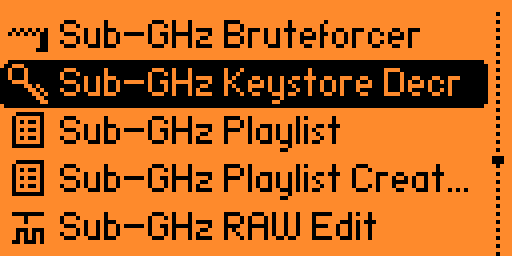
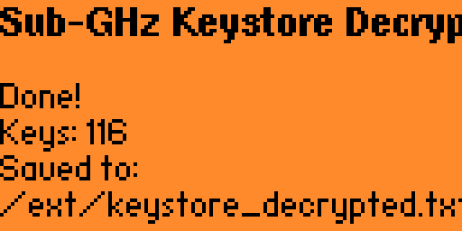

# Sub-GHz Keystore Decryptor for Flipper Zero
As the name suggests, if you've made it this far, you already know what the purpose of all this is.\
I'm not gonna share decrypted database here, at least build it by yourself.\
Decrypted keys will be stored on your SD Card under `/ext/keystore_decrypted.txt`.

## Why
To find out what types of keys are bundled with the firmware.

## Features
Decrypt KeeLoq database bundled with the firmware.
Works with any currently released firmware (e.g. Momentum rev. MNTM-012).

## Screenshots
|||
|:---:|:---:|
|  |  |

## Notes & limitations
- Decryption must be performed on the Flipper Zero device because the AES key is stored in its secure enclave.
- If any firmware owner uses a key from a different slot, the enclave ID will need to be adjusted. The same applies to IV permutations.
